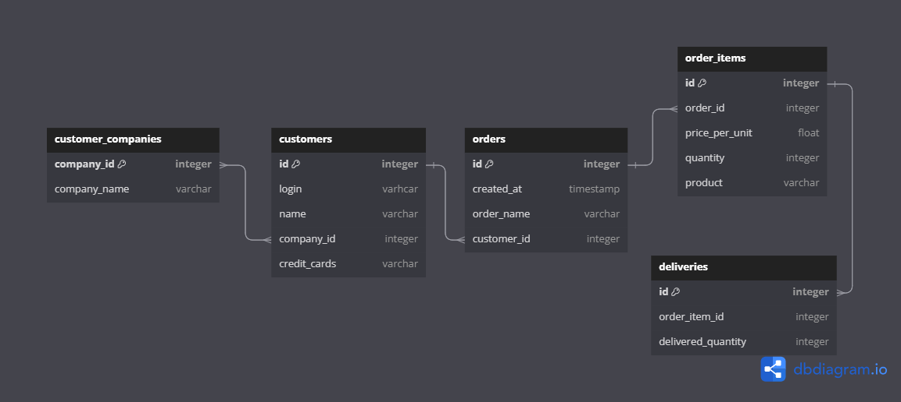

# PACKFORM PROJECT TEST

PACKFORM PROJECT TEST, this is design database using dbml 

## Table of Contents

- [PACKFORM PROJECT TEST](#packform-project-test)
  - [Table of Contents](#table-of-contents)
  - [Getting Started](#getting-started)
    - [Prerequisites](#prerequisites)
    - [Installation](#installation)
    - [Environment Variables](#environment-variables)
  - [Running server development](#running-server-development)
  - [Collection postman](#collection-postman)
  - [Running unit testing](#running-unit-testing)

## Getting Started

These instructions will get you a copy of the project up and running on your local machine for development and testing purposes.

### Prerequisites

What things you need to install the software and how to install them.

- [Golang](https://go.dev/dl/)
- [Postman](https://www.postman.com/downloads/)

### Installation

A step-by-step guide on setting up the project locally.

1. Clone the repository.

```bash
git clone https://github.com/jokosu10/packform-project-test.git
```

2. Navigate into the directory.

```bash
cd packform-project-test
```

3. Install the dependencies.

```bash
go mod tidy
```

### Environment Variables

How to setup envirotment variables.

1. Copy the `.env.example` file and create a new file called `.env`:

```bash
cp .env.example .env
```

2. Write the all configuration for project in file `.env`.

```env
INIT_DB=false
```

3. If you change configuration in file `.env`, please restart your server development.

## Running server development

How to running server developement.

1. Running for application using development environment.

```bash
go run main.go
```

## Collection postman

How to export collection in postman to test this API.

1. Export the API Collection via link from postman. Use this following link.

```link

```

## Running unit testing

How to running unit testing.

1. Running unit test for this application.

```bash
go test ./tests -v
```
